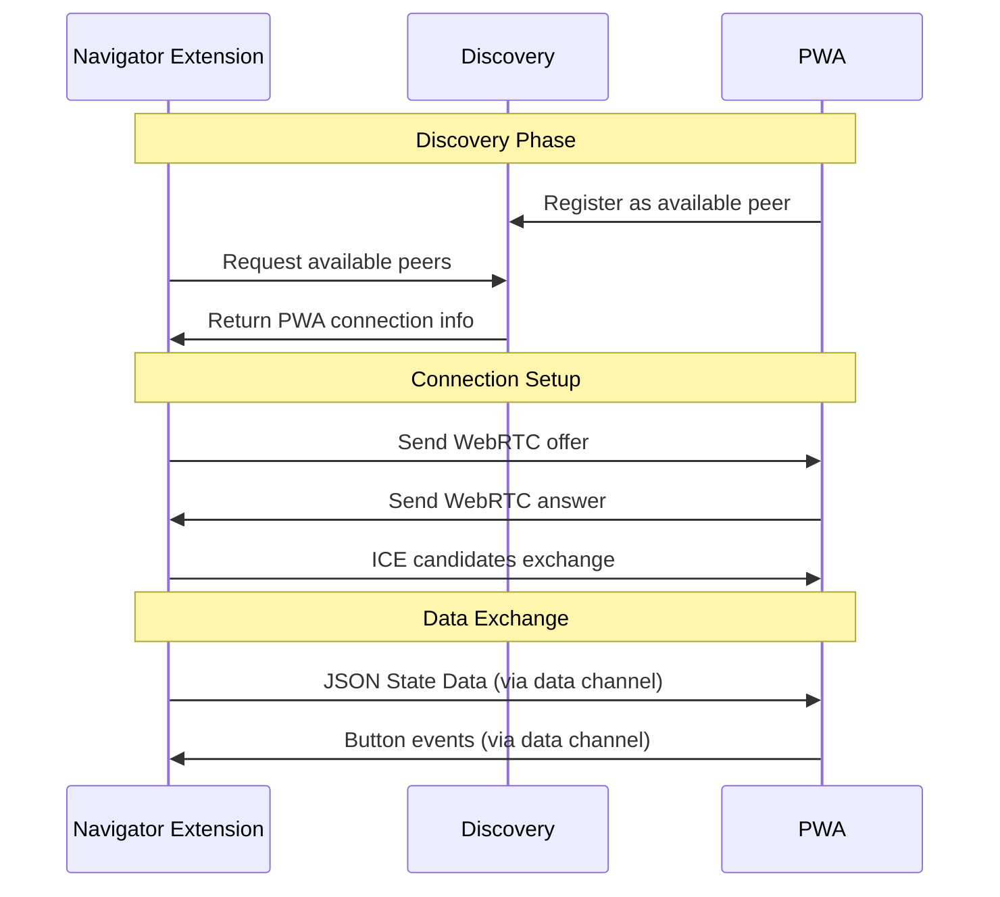
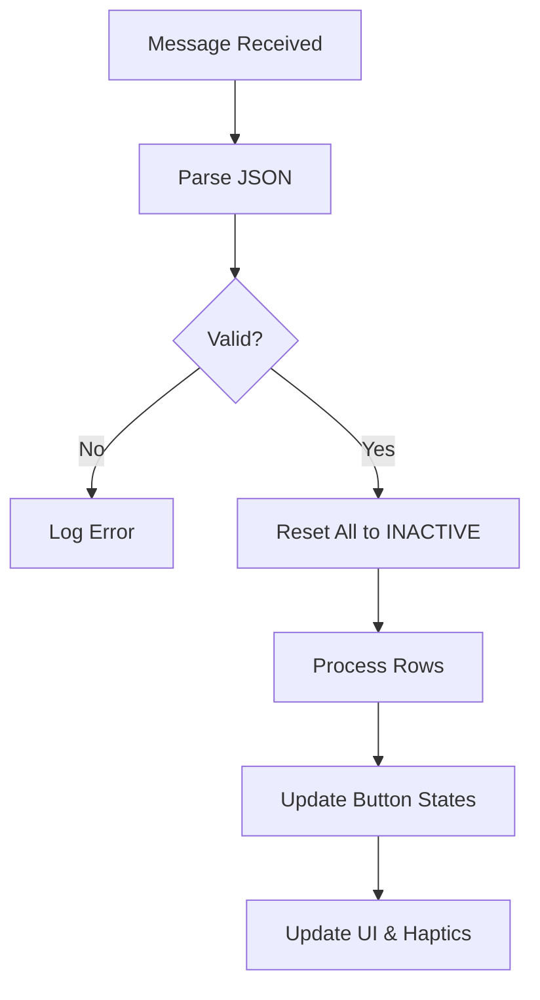
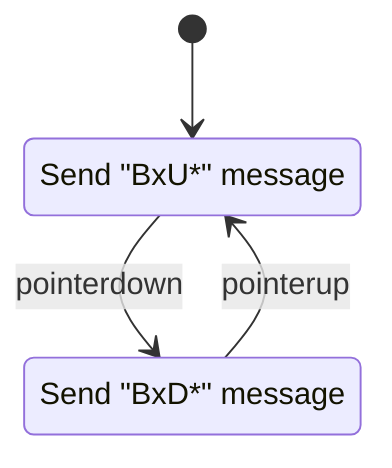
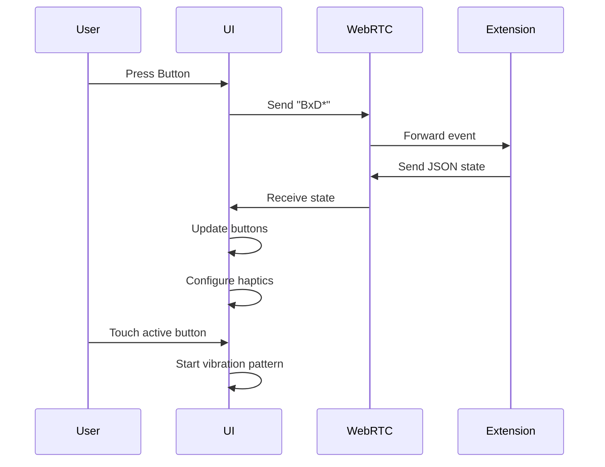

# **TOMAT Light Tech Docs (PWA + WebRTC Version)**

## **Overview**

The TOMAT Light system is a Progressive Web App (PWA) that provides a tactile interface with WebRTC communication capabilities. The system manages button states, provides haptic feedback, and communicates with external clients through peer-to-peer connections.

## **Architecture Overview**

```mermaid
graph TB
    subgraph "External Clients"
        A[TOMAT Navigator Extension]
    end
    
    subgraph "TOMAT Light PWA"
        B[WebRTC Connection Manager]
        C[State Manager]
        D[Button Grid UI]
        E[Haptic Feedback System]
        F[Service Discovery]
    end
    
    subgraph "Discovery Server"
        G[Connection Broker]
    end
    
    A <-WebRTC-> B
    F <-HTTP-> G
    B --> C
    C --> D
    D --> E
    D --> B
```

## **Component Details**

### **1. WebRTC Communication System**

The WebRTC manager handles peer-to-peer connections with the TOMAT Navigator extension.

**Key Features:**
- Manages WebRTC data channels
- Handles signaling via discovery server
- Maintains connection state
- Facilitates bidirectional communication



### **2. State Management System**

The State Manager translates external state data into button behaviors and manages the overall UI state.

**State Management Process:**
Same three-tier state hierarchy (INACTIVE, ACTIVE, PULSATING) but implemented in JavaScript.



**JSON Data Structure:**
```json
{
  "rows": [
    {
      "row": 0,
      "state": "ACTIVE"
    },
    {
      "row": 1,
      "buttons": [
        {"id": 0, "state": "PULSATING"},
        {"id": 1, "state": "ACTIVE"}
      ]
    }
  ]
}
```

### **3. Button System (HTML/JS Implementation)**

#### **HTML Structure**
```html
<div class="button-grid">
  <div class="button-row" data-row="0">
    <button class="grid-btn" data-id="0" aria-label="Button 0-0"></button>
    <button class="grid-btn" data-id="1" aria-label="Button 0-1"></button>
  </div>
  <!-- More rows... -->
</div>

<div class="nav-buttons">
  <button class="nav-btn" id="quit">Quit</button>
</div>
```

#### **Button Event Handling**


### **4. Haptic Feedback System**

Replaces Godot's vibration system with the Web Vibration API.

**Vibration Patterns:**
```javascript
// ACTIVE: Continuous vibration
function activeVibration() {
  navigator.vibrate([50, 50, 50, 50, ...]);
}

// PULSATING: Rhythmic pulses  
function pulsatingVibration() {
  navigator.vibrate([200, 100, 200, 100, ...]);
}
```



```mermaid
gantt
    title Vibration Patterns
    dateFormat X
    axisFormat %L
    
    section ACTIVE
    Vibrate 50ms :0, 50
    Vibrate 50ms :100, 150
    
    section PULSATING
    Vibrate 200ms :0, 200
    Pause 100ms :200, 300
```

### **5. Service Discovery**

Handles initial connection between PWA and extension:
1. PWA registers with discovery server
2. Extension queries server for available PWAs
3. Server facilitates WebRTC handshake

## **Complete Event Flow**



## **Key Differences from Godot Version**

1. **Communication**:
   - WebRTC instead of WebSockets
   - Direct peer-to-peer connections
   - No need for server to relay messages

2. **Technology Stack**:
   - HTML/CSS/JS instead of Godot
   - Web Vibration API for haptics
   - Service Worker for PWA functionality

3. **Distribution**:
   - Progressive Web App (installable)
   - No app store requirements
   - Instant updates

4. **Accessibility**:
   - Built-in screen reader support
   - Semantic HTML
   - ARIA attributes

## **Implementation Notes**

1. WebRTC requires HTTPS for production
2. Vibration API has limited browser support
3. Service Worker enables offline functionality
4. Touch events need to handle multi-touch scenarios

This design maintains all core functionality while leveraging modern web technologies for broader accessibility and easier distribution.