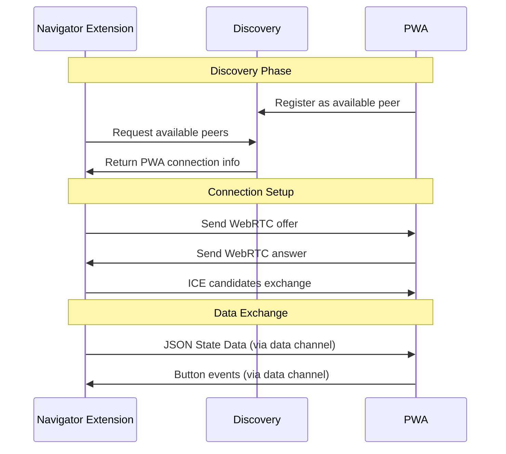
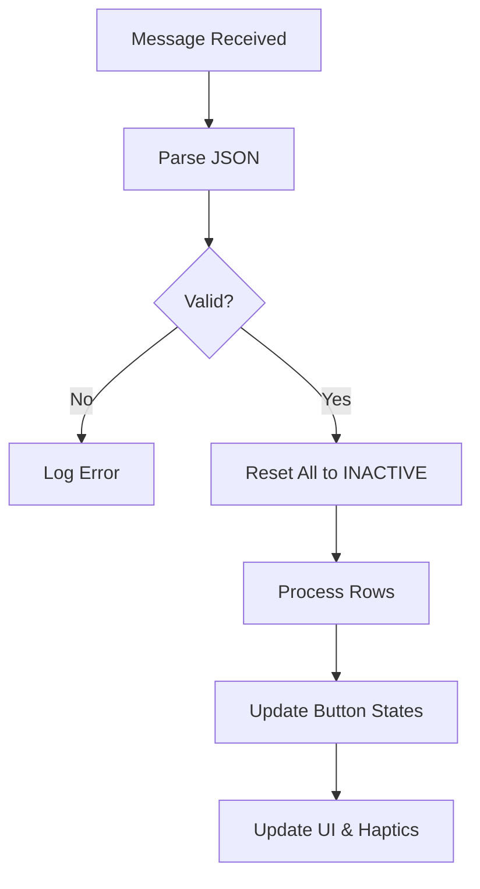
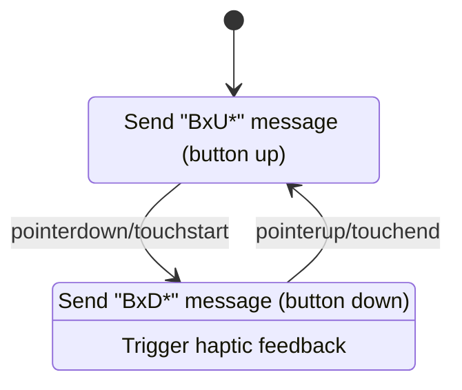
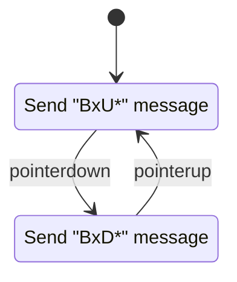
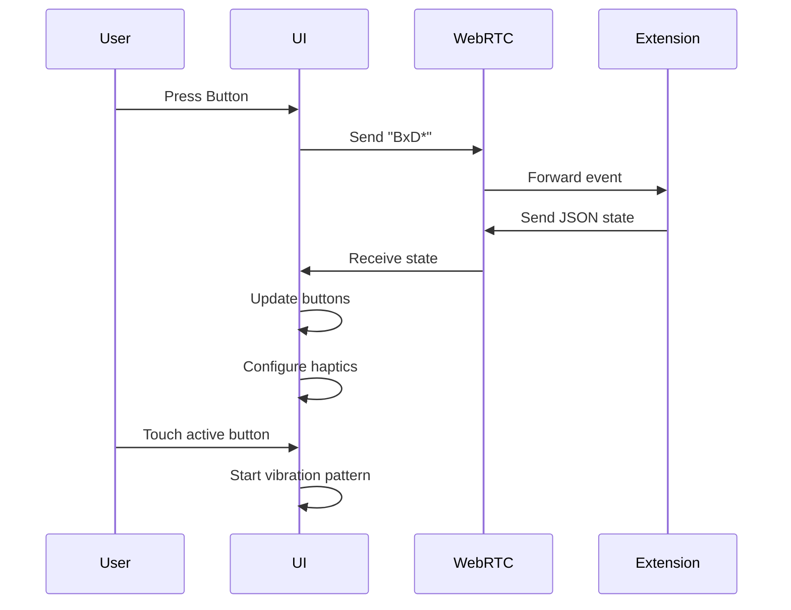

# **TOMAT Light Tech Docs (PWA + WebRTC Version)**

## **Overview**

The TOMAT Light system is a Progressive Web App (PWA) that provides a tactile interface with WebRTC communication capabilities. The system manages button states, provides haptic feedback, and communicates with external clients through peer-to-peer connections.

## **Architecture Overview**

```mermaid
graph TB
    subgraph "External Clients"
        A[TOMAT Navigator Extension]
    end
    
    subgraph "TOMAT Light PWA"
        B[WebRTC Connection Manager]
        C[State Manager]
        D[Button Grid UI]
        E[Haptic Feedback System]
        F[Service Discovery]
    end
    
    subgraph "Discovery Server"
        G[Connection Broker]
    end
    
    A <-WebRTC-> B
    F <-HTTP-> G
    B --> C
    C --> D
    D --> E
    D --> B
```

## **Component Details**

### **1. WebRTC Communication System**

The WebRTC manager handles peer-to-peer connections with the TOMAT Navigator extension.

**Key Features:**
- Manages WebRTC data channels
- Handles signaling via discovery server
- Maintains connection state
- Facilitates bidirectional communication



### **2. State Management System**

The State Manager translates external state data into button behaviors and manages the overall UI state.

**State Management Process:**
Same three-tier state hierarchy (INACTIVE, ACTIVE, PULSATING) but implemented in JavaScript.



**JSON Data Structure:**
```json
{
  "rows": [
    {
      "row": 0,
      "state": "ACTIVE"
    },
    {
      "row": 1,
      "buttons": [
        {"id": 0, "state": "PULSATING"},
        {"id": 1, "state": "ACTIVE"}
      ]
    }
  ]
}
```

### **3. Button System (HTML/JS Implementation)**


#### **HTML Structure**

The TOMAT UI consists of a grid of buttons organized into rows with navigation controls:

```html
<div class="scene">
  <div class="tomat-ui">
    <!-- Main button grid (4 rows) -->
    <div class="element-rows">
      <!-- Each row contains 4 content buttons + enter button -->
      <div class="element-row">
        <button class="row-button" onclick="handleRowButton('h1')">h1</button>
        <div class="row-separator"></div>
        <button class="row-button" onclick="handleRowButton('h2')">h2</button>
        <div class="row-separator"></div>
        <button class="row-button" onclick="handleRowButton('h3')">h3</button>
        <div class="row-separator"></div>
        <button class="row-button" onclick="handleRowButton('h4')">h4</button>
        <div class="row-separator" style="width: 16px;"></div>
        <button class="row-button enter-button" onclick="handleInput('enter')">↵</button>
      </div>
      <!-- Repeat for 3 more rows -->
    </div>

    <!-- Navigation buttons -->
    <div class="nav-buttons">
      <button class="nav-button star" onclick="handleNavButton('F')">*</button>
      <button class="nav-button" onclick="handleNavButton('P')">+</button>
      <button class="nav-button" onclick="handleNavButton('M')">-</button>
      <button class="nav-button" onclick="handleNavButton('U')">↑</button>
      <button class="nav-button" onclick="handleNavButton('D')">↓</button>
      <button class="nav-button" onclick="handleNavButton('N')">></button>
    </div>

    <!-- Quit button -->
    <button class="quit-button" onclick="handleQuit()">Quit</button>
  </div>
</div>
```

#### **CSS Styling**

The UI uses a dark theme with responsive button sizing:

```css
/* Core button styles */
.row-button {
  flex: 1;
  background: #4a4a4a;
  border: 1px solid #666;
  border-radius: 4px;
  color: white;
  font-size: 36px;
  font-weight: bold;
  cursor: pointer;
  transition: all 0.2s ease;
}

/* Special button types */
.enter-button {
  background: #0066cc;
  border-color: #0077dd;
}

.nav-button {
  flex: 1;
  height: 80px;
  font-size: 48px;
}

.nav-button.star {
  background: #cc6600;
  border-color: #dd7700;
}

.quit-button {
  background: #cc0000;
  border-color: #dd0000;
  font-size: 28px;
}

/* Interactive states */
button:hover {
  filter: brightness(1.2);
}

button:active {
  transform: scale(0.95);
}
```

#### **Button State Management**

The system supports three visual states that can be applied through CSS classes:

```javascript
// Example state update function
function updateButtonState(buttonElement, state) {
  // Remove all state classes
  buttonElement.classList.remove('inactive', 'active', 'pulsating');
  
  // Add the appropriate state class
  switch(state) {
    case 'INACTIVE':
      buttonElement.classList.add('inactive');
      break;
    case 'ACTIVE':
      buttonElement.classList.add('active');
      break;
    case 'PULSATING':
      buttonElement.classList.add('pulsating');
      // Start pulsating animation
      break;
  }
}
```

#### **Event Handling**

Button events follow this state diagram:



#### **Complete Button Implementation Example**

```javascript
// Initialize all buttons
document.querySelectorAll('.row-button, .nav-button, .quit-button').forEach(btn => {
  // Add touch/click handlers
  btn.addEventListener('pointerdown', handleButtonDown);
  btn.addEventListener('pointerup', handleButtonUp);
  btn.addEventListener('touchstart', handleButtonDown);
  btn.addEventListener('touchend', handleButtonUp);
  
  // Initial state
  btn.classList.add('inactive');
});

function handleButtonDown(e) {
  const button = e.currentTarget;
  const buttonType = button.classList.contains('nav-button') ? 'nav' : 
                    button.classList.contains('quit-button') ? 'quit' : 'row';
  
  // Send button press event via WebRTC
  sendButtonEvent(`${buttonType}-down`, getButtonId(button));
  
  // Visual feedback
  button.style.transform = 'scale(0.95)';
  
  // Haptic feedback
  navigator.vibrate?.(50);
}

function getButtonId(button) {
  // Implementation to get button's row/position
  // Could use data attributes or other identification method
}
```

#### **Responsive Design**

The UI includes media queries to adapt to different screen sizes:

```css
@media (max-width: 480px) {
  .row-button { font-size: 32px; }
  .nav-button { font-size: 42px; }
  .quit-button { font-size: 24px; }
}

@media (max-width: 360px) {
  .row-button { font-size: 28px; }
  .nav-button { font-size: 38px; }
  .quit-button { font-size: 22px; }
}
```

#### **Accessibility Features**

The implementation includes:
- Semantic HTML buttons
- Touch target sizing that meets WCAG guidelines
- High contrast color scheme
- Visual feedback for interactions
- Haptic feedback where supported


#### **HTML Structure**
```html
<div class="button-grid">
  <div class="button-row" data-row="0">
    <button class="grid-btn" data-id="0" aria-label="Button 0-0"></button>
    <button class="grid-btn" data-id="1" aria-label="Button 0-1"></button>
  </div>
  <!-- More rows... -->
</div>

<div class="nav-buttons">
  <button class="nav-btn" id="quit">Quit</button>
</div>
```

#### **Button Event Handling**


### **4. Haptic Feedback System**

Replaces Godot's vibration system with the Web Vibration API.

**Vibration Patterns:**
```javascript
// ACTIVE: Continuous vibration
function activeVibration() {
  navigator.vibrate([50, 50, 50, 50, ...]);
}

// PULSATING: Rhythmic pulses  
function pulsatingVibration() {
  navigator.vibrate([200, 100, 200, 100, ...]);
}
```



```mermaid
gantt
    title Vibration Patterns
    dateFormat X
    axisFormat %L
    
    section ACTIVE
    Vibrate 50ms :0, 50
    Vibrate 50ms :100, 150
    
    section PULSATING
    Vibrate 200ms :0, 200
    Pause 100ms :200, 300
```

### **5. Service Discovery**

Handles initial connection between PWA and extension:
1. PWA registers with discovery server
2. Extension queries server for available PWAs
3. Server facilitates WebRTC handshake

## **Complete Event Flow**


