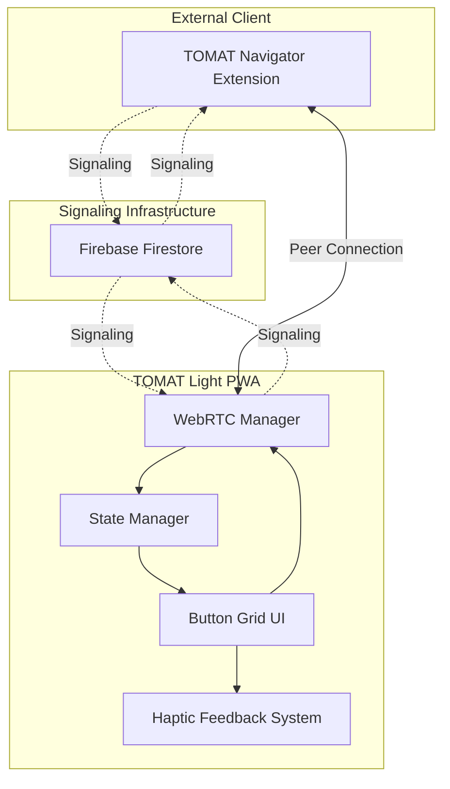
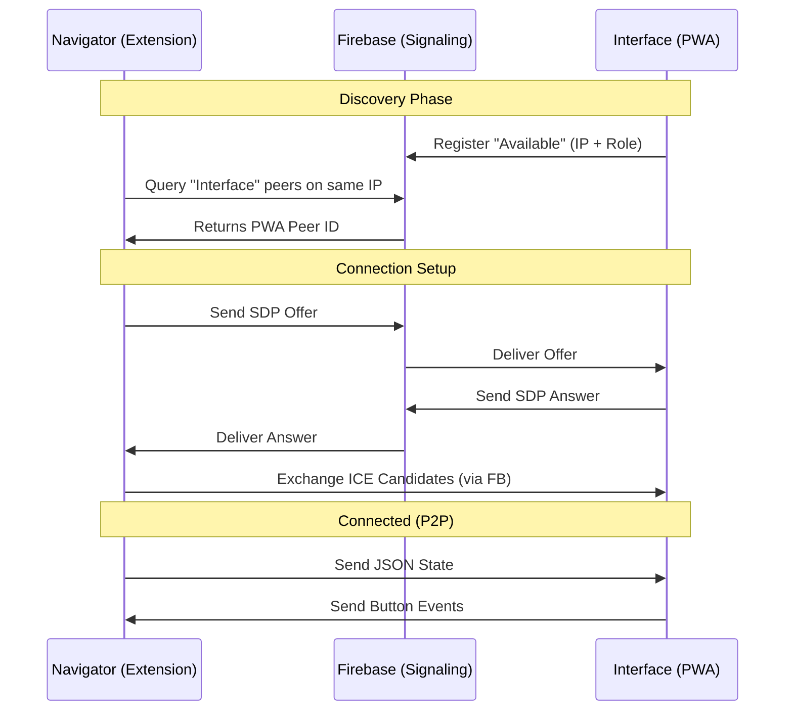
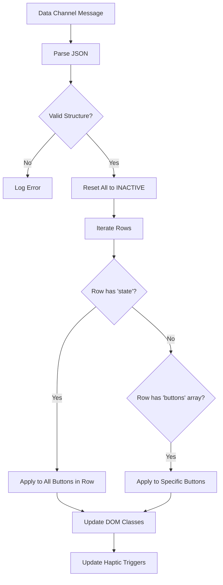
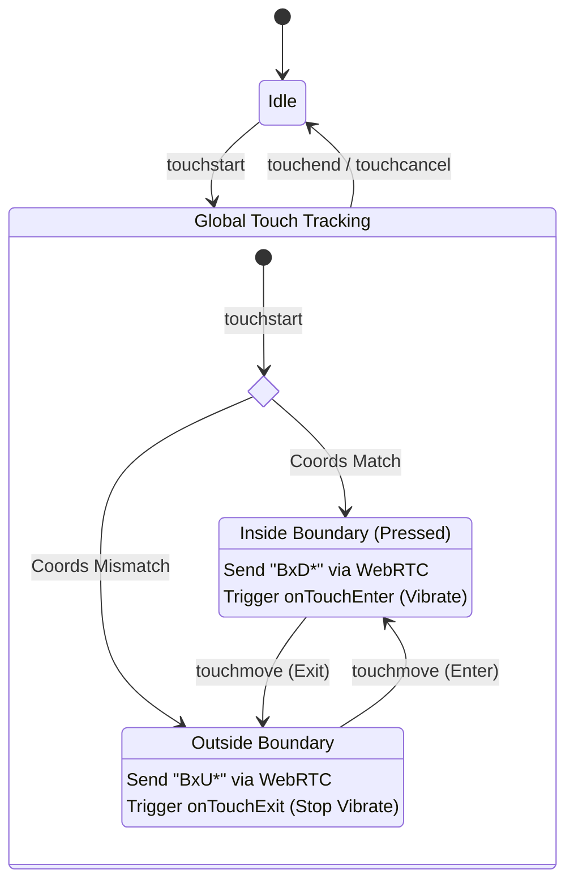
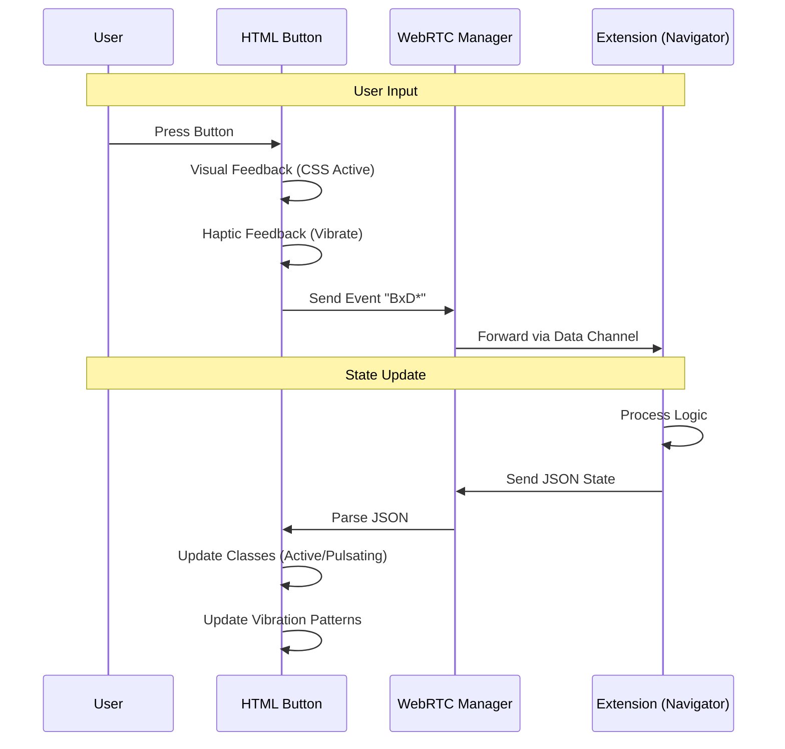

# **TOMAT Light PWA Implementation**

## **Overview**

The TOMAT Light system is a Progressive Web App (PWA) that provides a tactile interface with WebRTC communication capabilities. It runs natively in the browser, managing button states, providing haptic feedback via the Web Vibration API, and communicating with external clients (Navigator Extension) through peer-to-peer WebRTC connections.

## **Architecture Overview**

The system follows a peer-to-peer architecture where the PWA acts as the "Interface" and the Chrome Extension acts as the "Navigator". Firebase Firestore is used strictly as a signaling broker to establish the connection, after which data flows directly between peers.


```mermaid
graph TB
    subgraph "External Client"
        A[TOMAT Navigator Extension]
    end
    
    subgraph "TOMAT Light PWA"
        B[WebRTC Manager]
        C[State Manager]
        D[Button Grid UI]
        E[Haptic Feedback System]
    end
    
    subgraph "Signaling Infrastructure"
        F[Firebase Firestore]
    end
    
    A -. "Signaling" .-> F
    F -. "Signaling" .-> A
    B -. "Signaling" .-> F
    F -. "Signaling" .-> B
    
    A <-- "Peer Connection" --> B
    B --> C
    C --> D
    D --> E
    D --> B
```

## **Component Details**

### **1. WebRTC Communication System**

The `WebRTCManager` is the central communication hub. It handles the complexity of NAT traversal, signaling, and connection state management.

**Key Features:**

- **Role-Based Connection:** The PWA always assumes the `interface` role, while the extension assumes the `navigator` role.
- **Deterministic Identity:** Peer IDs are generated by hashing the Public IP and User Agent. This ensures that refreshing the page recovers the same identity, preventing "ghost" peers.
- **Local Network Discovery:** Peers discover each other by querying Firestore for the opposite role sharing the same Public IP.


```mermaid
sequenceDiagram
    participant Nav as Navigator (Extension)
    participant FB as Firebase (Signaling)
    participant PWA as Interface (PWA)
    
    Note over Nav,PWA: Discovery Phase
    PWA->>FB: Register "Available" (IP + Role)
    Nav->>FB: Query "Interface" peers on same IP
    FB->>Nav: Returns PWA Peer ID
    
    Note over Nav,PWA: Connection Setup
    Nav->>FB: Send SDP Offer
    FB->>PWA: Deliver Offer
    PWA->>FB: Send SDP Answer
    FB->>Nav: Deliver Answer
    Nav->>PWA: Exchange ICE Candidates (via FB)
    
    Note over Nav,PWA: Connected (P2P)
    Nav->>PWA: Send JSON State
    PWA->>Nav: Send Button Events
```

### **2. State Management System**

The State Manager translates external state data into button behaviors. It processes JSON payloads received via the WebRTC Data Channel to update the UI and haptic patterns.

**State Hierarchy:**

1. **INACTIVE** (Gray, No Feedback)
2. **ACTIVE** (Green, Continuous Vibration)
3. **PULSATING** (Red, Rhythmic Vibration)

**Data Processing Flow:**


```mermaid
flowchart TD
    A[Data Channel Message] --> B[Parse JSON]
    B --> C{Valid Structure?}
    C -->|No| D[Log Error]
    C -->|Yes| E[Reset All to INACTIVE]
    E --> F[Iterate Rows]
    F --> G{Row has 'state'?}
    G -->|Yes| H[Apply to All Buttons in Row]
    G -->|No| I{Row has 'buttons' array?}
    I -->|Yes| J[Apply to Specific Buttons]
    H --> K[Update DOM Classes]
    J --> K
    K --> L[Update Haptic Triggers]
```

**JSON Data Structure:**
```json
{
  "rows": [
    {
      "row": 0,
      "state": "ACTIVE" 
    },
    {
      "row": 1,
      "buttons": [
        {"id": 0, "state": "PULSATING"},
        {"id": 1, "state": "ACTIVE"}
      ]
    }
  ]
}
```

### **3. Button System Implementation**

#### **HTML Structure**

The TOMAT UI consists of a grid of buttons organized into rows with navigation controls:

```html
<div class="scene">
  <div class="tomat-ui">
    <!-- Main button grid (4 rows) -->
    <div class="element-rows">
      <!-- Each row contains 4 content buttons + enter button -->
      <div class="element-row">
        <button class="row-button" onclick="handleRowButton('h1')">h1</button>
        <div class="row-separator"></div>
        <button class="row-button" onclick="handleRowButton('h2')">h2</button>
        <div class="row-separator"></div>
        <button class="row-button" onclick="handleRowButton('h3')">h3</button>
        <div class="row-separator"></div>
        <button class="row-button" onclick="handleRowButton('h4')">h4</button>
        <div class="row-separator" style="width: 16px;"></div>
        <button class="row-button enter-button" onclick="handleInput('enter')">↵</button>
      </div>
      <!-- Repeat for 3 more rows -->
    </div>

    <!-- Navigation buttons -->
    <div class="nav-buttons">
      <button class="nav-button star" onclick="handleNavButton('F')">*</button>
      <button class="nav-button" onclick="handleNavButton('P')">+</button>
      <button class="nav-button" onclick="handleNavButton('M')">-</button>
      <button class="nav-button" onclick="handleNavButton('U')">↑</button>
      <button class="nav-button" onclick="handleNavButton('D')">↓</button>
      <button class="nav-button" onclick="handleNavButton('N')">></button>
    </div>

    <!-- Quit button -->
    <button class="quit-button" onclick="handleQuit()">Quit</button>
  </div>
</div>
```

#### **CSS Styling**

The UI uses a dark theme with responsive button sizing:

```css
/* Core button styles */
.row-button {
  flex: 1;
  background: #4a4a4a;
  border: 1px solid #666;
  border-radius: 4px;
  color: white;
  font-size: 36px;
  font-weight: bold;
  cursor: pointer;
  transition: all 0.2s ease;
}

/* State-specific styling */
.row-button.inactive {
  background: #4a4a4a;
}

.row-button.active {
  background: #00cc00;
}

.row-button.pulsating {
  background: #cc0000;
  animation: pulse 1s infinite;
}

@keyframes pulse {
  0%, 100% { opacity: 1; }
  50% { opacity: 0.6; }
}

/* Special button types */
.enter-button {
  background: #0066cc;
  border-color: #0077dd;
}

.nav-button {
  flex: 1;
  height: 80px;
  font-size: 48px;
}

.nav-button.star {
  background: #cc6600;
  border-color: #dd7700;
}

.quit-button {
  background: #cc0000;
  border-color: #dd0000;
  font-size: 28px;
}

/* Interactive states */
button:hover {
  filter: brightness(1.2);
}

/* Responsive design */
@media (max-width: 480px) {
  .row-button { font-size: 32px; }
  .nav-button { font-size: 42px; }
  .quit-button { font-size: 24px; }
}

@media (max-width: 360px) {
  .row-button { font-size: 28px; }
  .nav-button { font-size: 38px; }
  .quit-button { font-size: 22px; }
}
```

#### **Advanced Input Handling**

To ensure robust tactile feedback on mobile devices, the application bypasses standard "hover" events (which often fail during active touch sliding) and implements a **manual coordinate-tracking system**.

**Key Implementation Details:**

1. **Global Event Listeners**
   - Attached at `document` level to track finger movement continuously
   - `touchstart`: Captures initial contact and flags input as touch device
   - `touchmove`: Core logic for detecting entry/exit via coordinate comparison
   - `touchend`/`touchcancel`: Cleans up state and halts vibration

2. **Coordinate Detection Logic**
   ```javascript
   class VibrationHandler {
     constructor() {
       this.activeTouch = null;
       this.isTouchDevice = false;
       this.buttons = new Map();
     }
     
     updateTouchPosition(x, y) {
       // Manual hit detection against button boundaries
       for (const [button, bounds] of this.buttons) {
         const isInside = Utils.isPointInsideCircle(x, y, bounds);
         if (isInside && !button.isTouched) {
           this.triggerEnter(button);
         } else if (!isInside && button.isTouched) {
           this.triggerExit(button);
         }
       }
     }
   }
   ```

**Input State Diagram:**


```mermaid
stateDiagram-v2
    [*] --> Idle

    state "Global Touch Tracking" as Tracking {
        state "Inside Boundary (Pressed)" as Inside
        state "Outside Boundary" as Outside
        state init <<choice>>

        [*] --> init: touchstart
        init --> Inside: Coords Match
        init --> Outside: Coords Mismatch

        Outside --> Inside: touchmove (Enter)
        Inside --> Outside: touchmove (Exit)
    }

    Idle --> Tracking: touchstart
    Tracking --> Idle: touchend / touchcancel

    Inside: Send "BxD*" via WebRTC
    Inside: Trigger onTouchEnter (Vibrate)

    Outside: Send "BxU*" via WebRTC
    Outside: Trigger onTouchExit (Stop Vibrate)
```

#### **Button State Management**

```javascript
function updateButtonState(buttonElement, state) {
  // Remove all state classes
  buttonElement.classList.remove('inactive', 'active', 'pulsating');
  
  // Add the appropriate state class
  switch(state) {
    case 'INACTIVE':
      buttonElement.classList.add('inactive');
      break;
    case 'ACTIVE':
      buttonElement.classList.add('active');
      break;
    case 'PULSATING':
      buttonElement.classList.add('pulsating');
      // Start pulsating animation
      break;
  }
}
```

### **4. Haptic Feedback System**

Replaces Godot's vibration system with the Web Vibration API.

**Vibration Patterns:**
```javascript
// ACTIVE: Continuous vibration
function activeVibration() {
  // Create 2-second continuous pattern: 50ms on, 50ms off
  const pattern = [];
  for (let i = 0; i < 20; i++) {
    pattern.push(50, 50);
  }
  navigator.vibrate(pattern);
}

// PULSATING: Rhythmic pulses  
function pulsatingVibration() {
  // Heartbeat pattern: 200ms on, 100ms off
  navigator.vibrate([200, 100, 200, 100, 200, 100, 200]);
}

// Stop all vibration
function stopVibration() {
  navigator.vibrate(0);
}
```


```mermaid
gantt
    title Vibration Patterns
    dateFormat X
    axisFormat %L
    
    section ACTIVE
    Vibrate 50ms :0, 50
    Pause 50ms :50, 100
    Vibrate 50ms :100, 150
    Pause 50ms :150, 200
    
    section PULSATING
    Vibrate 200ms :0, 200
    Pause 100ms :200, 300
    Vibrate 200ms :300, 500
    Pause 100ms :500, 600
```

### **5. Signaling & Discovery System**

The `SignalingManager` abstracts the Firestore interactions required to bootstrap the WebRTC connection.

**Signaling Workflow:**

1. **Initialization:** The app loads and retrieves the public IP via STUN server.
2. **Registration:** The PWA writes a document to the `peers` collection with:
   ```javascript
   {
     peerId: 'hashed-ip-and-ua',
     role: 'interface',
     status: 'available',
     publicIp: '192.168.x.x',
     lastSeen: firebase.firestore.FieldValue.serverTimestamp()
   }
   ```
3. **Heartbeat:** A `setInterval` updates the `lastSeen` timestamp every 10 seconds.
4. **Handshake:** The PWA listens for documents in the `sessions` collection where `targetPeer` matches its ID, then processes offers/answers/candidates.

### **6. Sidebar Controller (Chrome Extension)**

The sidebar acts as the remote controller for the PWA.

**Interaction Logic:**

- **Connectivity**: Listens to `onConnectionStateChange`. When connected, enables the message input.
- **Messaging**: 
  - `dataChannel.send(text)`: Sends user input to the PWA.
  - `dataChannel.onmessage`: Receives data from the PWA. If it's a string, it's logged to the UI; if it's JSON, it's processed as state data.
- **Persistence**: Uses the extension background script to maintain the WebRTC session, allowing the sidebar to be closed and reopened without losing the peer connection.

### **7. Complete Event Flow**

The following diagram illustrates the complete round-trip from a user pressing a button to receiving a state update.


```mermaid
sequenceDiagram
    participant User
    participant UI as HTML Button
    participant WRTC as WebRTC Manager
    participant Ext as Extension (Navigator)
    
    Note over User,Ext: User Input
    User->>UI: Press Button
    UI->>UI: Visual Feedback (CSS Active)
    UI->>UI: Haptic Feedback (Vibrate)
    UI->>WRTC: Send Event "BxD*"
    WRTC->>Ext: Forward via Data Channel
    
    Note over User,Ext: State Update
    Ext->>Ext: Process Logic
    Ext->>WRTC: Send JSON State
    WRTC->>UI: Parse JSON
    UI->>UI: Update Classes (Active/Pulsating)
    UI->>UI: Update Vibration Patterns
```

## **Technical Implementation Notes**

### **PWA Features**
- **Service Worker**: For offline functionality and background syncing
- **Web App Manifest**: Enables installation to home screen
- **Secure Context**: Requires HTTPS for WebRTC and Vibration API

### **Browser Compatibility**
- **WebRTC**: Chrome 74+, Firefox 68+, Safari 13.1+
- **Vibration API**: Chrome 32+, Firefox 47+, Safari (No Support)
- **PWA Features**: Chrome 68+, Firefox 86+, Safari 16.4+

### **Performance Considerations**
- **Touch Events**: Debounced to prevent excessive vibration triggering
- **WebRTC**: Data channels optimized for small message sizes (<16KB)
- **Animation**: CSS transforms for smooth button interactions
- **Memory**: Cleanup of event listeners on page unload

## **Security & Privacy**

1. **WebRTC Security**: DTLS encryption for all peer-to-peer data
2. **Firestore Rules**: Restrictive security rules allowing only necessary operations
3. **No Data Persistence**: Button states and messages not stored persistently
4. **Local Network Only**: Discovery limited to peers sharing the same public IP

## **Deployment**

1. **Firebase Setup**: Configure Firestore with appropriate security rules
2. **Web Server**: HTTPS required for PWA installation and WebRTC
3. **Extension**: Package and deploy to Chrome Web Store
4. **Updates**: Service worker caching strategy for offline functionality
